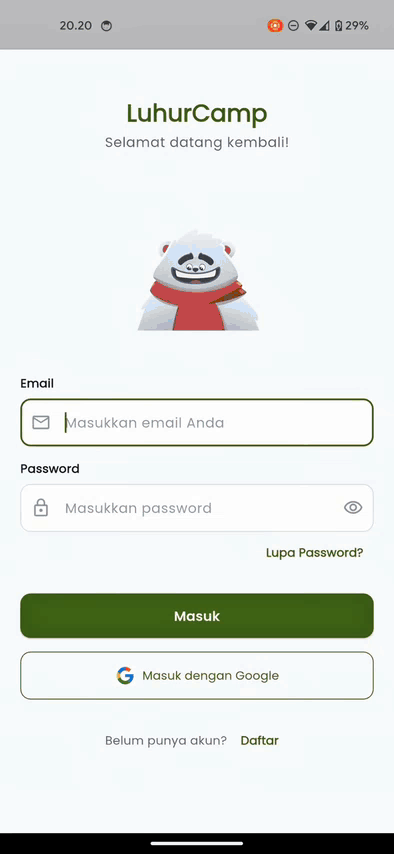

# LuhurCamp

  

  <strong>Sistem Manajemen Reservasi Camping Ground</strong>

  <a href="#fitur-utama">Fitur</a> •
  <a href="#demo">Demo</a> •
  <a href="#screenshots">Screenshots</a> •
  <a href="#tech-stack">Tech Stack</a> •
  <a href="#dokumentasi">Dokumentasi</a> •
  <a href="#repository-terkait">Repository</a> •
  <a href="#developer">Developer</a>

---

## Tentang

**LuhurCamp** adalah sistem manajemen reservasi _camping ground_ modern yang terdiri dari **Panel Admin Web** (untuk pengelola) dan **Aplikasi Mobile** (untuk pelanggan).

Sistem ini bekerja secara terintegrasi:

- **Web App** menyediakan landing page informatif, sistem registrasi & login, serta panel admin untuk pengelolaan operasional camping ground.
- **Mobile App** dapat diunduh setelah pengguna melakukan registrasi melalui web, untuk melakukan pemesanan kavling, penyewaan peralatan, dan mendapatkan tiket QR Code.

Proyek ini bertujuan untuk mendigitalkan proses pemesanan kavling, penyewaan peralatan, dan operasional harian di lokasi camping.

---

## Fitur Utama

### 🏠 Halaman Publik

- **Landing Page** - Informasi lengkap tentang camping ground dan fasilitasnya
- **Registrasi & Login** - Sistem autentikasi pengguna untuk akses mobile app

### 🔧 Panel Admin

- **Dashboard** - Ringkasan okupansi, pendapatan, dan booking terbaru
- **Master Data Kavling** - CRUD kavling dengan foto dan harga
- **Master Data Peralatan** - Manajemen stok peralatan camping
- **Daftar Booking** - Melihat dan mengelola semua pesanan
- **Verifikasi Pembayaran** - Terima atau tolak bukti bayar pelanggan
- **Smart Scanner** - Scan QR Code untuk Check-in & Check-out
- **Laporan** - Cetak laporan pendapatan dan tingkat hunian (PDF)
- **Galeri** - Kelola foto-foto lokasi camping
- **Pengaturan Profil** - Manajemen profil admin
- **Pengumuman** - Kelola pengumuman untuk pengguna

---

## Demo

|                                   🌐 Demo Aplikasi Web                                    |                                    📱 Demo Aplikasi Mobile                                     |
| :---------------------------------------------------------------------------------------: | :--------------------------------------------------------------------------------------------: |
|  |  |
|                      _Demo navigasi dan fitur utama web admin panel_                      |                       _Demo penggunaan aplikasi mobile untuk reservasi_                        |

---

## Screenshots

### Halaman Publik

|                        Landing Page                        |                          Landing Page (lanjutan)                          |
| :--------------------------------------------------------: | :-----------------------------------------------------------------------: |
|  |  |

|                  Halaman Welcome                  |                   Halaman Registrasi                    |
| :-----------------------------------------------: | :-----------------------------------------------------: |
|  |  |

|                 Halaman Login                 |
| :-------------------------------------------: |
|  |

### Panel Admin

|                    Dashboard Admin                     |                    Master Data Kavling                     |
| :----------------------------------------------------: | :--------------------------------------------------------: |
|  |  |

|                     Master Data Peralatan                     |                             Daftar Booking                             |
| :-----------------------------------------------------------: | :--------------------------------------------------------------------: |
|  |  |

|                                    QR Scanner                                     |                    Verifikasi Pembayaran                     |
| :-------------------------------------------------------------------------------: | :----------------------------------------------------------: |
|  |  |

|                 Halaman Galeri                  |                  Halaman Laporan                  |
| :---------------------------------------------: | :-----------------------------------------------: |
|  |  |

|                   Pengaturan Profil                   |                     Pengaturan Pengumuman                     |
| :---------------------------------------------------: | :-----------------------------------------------------------: |
|  |  |

---

## Tech Stack

### Backend

| Komponen    | Teknologi                         |
| :---------- | :-------------------------------- |
| Framework   | [Laravel 10](https://laravel.com) |
| Bahasa      | PHP 8.1+                          |
| Database    | MySQL                             |
| Autentikasi | Laravel Sanctum Session Cookie    |
| API         | RESTful API                       |

### Frontend

| Komponen        | Teknologi       |
| :-------------- | :-------------- |
| Template Engine | Blade Templates |
| Styling         | Tailwind CSS    |
| Build Tool      | Vite            |
| JavaScript      | Alpine.js       |

---

## Dokumentasi

Dokumen teknis detail tersedia di folder `/docs`:

| Dokumen                                  | Deskripsi                          |
| :--------------------------------------- | :--------------------------------- |
| [SRS](docs/SRS.md)                       | Software Requirement Specification |
| [SDD](docs/SDD.md)                       | System Design Document             |
| [Technical Spec](docs/Technical_Spec.md) | Stack teknologi dan standar kode   |
| [Business Logic](docs/Business_Logic.md) | Alur bisnis dan flowchart          |
| [Project Plan](docs/Project_Plan.md)     | Timeline pengembangan              |

---

## Repository Terkait

| Repository                                                               | Deskripsi                         |
| :----------------------------------------------------------------------- | :-------------------------------- |
| [LuhurCamp-Web-App](https://github.com/BayuAjiPrayoga/LuhurCamp-Web-App) | Backend Laravel + Web Admin Panel |
| [SkyCamp_Mobile](https://github.com/BayuAjiPrayoga/SkyCamp_Mobile)       | Aplikasi Mobile Flutter           |

---

## Developer

|                 |                         |
| :-------------- | :---------------------- |
| **NPM**         | 23552011194             |
| **Nama**        | BAYU AJI PRAYOGA        |
| **Kelas**       | TIF RP - 23 CNS A       |
| **Mata Kuliah** | Pemrograman Web 1 (UAS) |

---

© 2025 LuhurCamp. All Rights Reserved.

